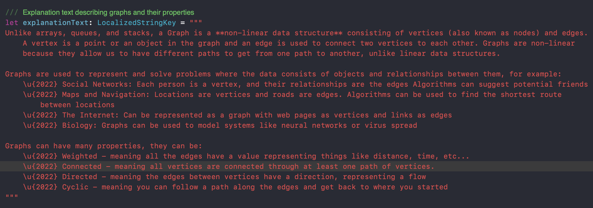
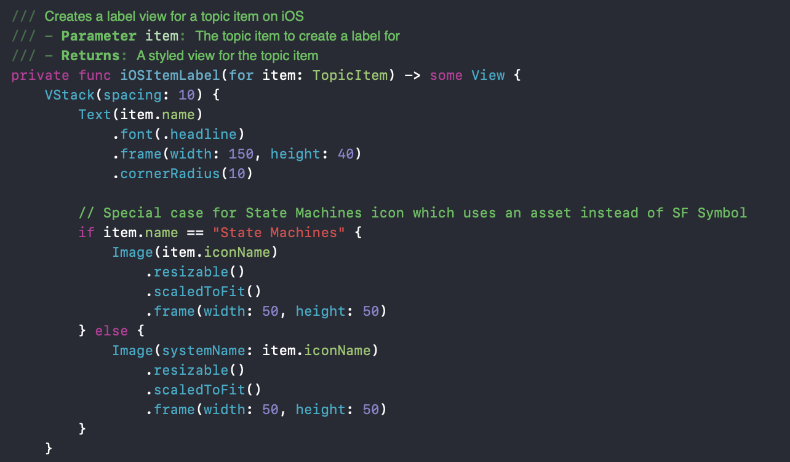

# Unplugged Activities for Schools with Apple TV

Unplugged activities describe a method of teaching where the focus is on the deeper conceptual ideas, rather than direct practical implementation. I.e. understanding how an algorithm works instead of simply writing code to implement it.

This project takes this idea and digitises these activities, making them available for Apple TVs and iPads or any other tvOS and iOS devices, respectively. 

## Installation Instructions

$${\color{red}\text{THIS APP IS NOT CURRENTLY ON THE APP STORE}}$$
$${\color{red}\text{YOU WILL HAVE TO MANUALLY INSTALL AND BUILD THE APP USING XCODE}}$$

1. Download Xcode [at this link](https://apps.apple.com/us/app/xcode/id497799835?mt=12)
2. In Xcode, click `Clone Git Repository...` and enter this link : `https://github.com/Ahmed-Ibrahim-3/CS-Unplugged.git` in the search bar
3. Click clone, wait for the next popup, select a destination, and click clone again
4. Xcode should now open and you should see the project
5. Enable developer mode on the device you wish to build the app to. Follow [these](https://developer.apple.com/documentation/xcode/enabling-developer-mode-on-a-device) instructions.
6. If building to an iOS device, in the menu bar select `Product` -> `Destiation`. From this list, select your device.
7. If building to tvOS, if the device is not in the list, scroll to the bottom of the devices list and click on `Manage Run Destinations...` and navigate to the `Devices` menu.
8. If the device is still not in this list, add it using the `+` button. a 4 digit code should be displayed on the Apple tv to enter into xcode to complete the pairing.
9. You can now install and use this app on either device. Note that the app will become unavailable after 1 week, so you will need to rebuild it, though this is much easier with already paired devices.

## Contribution Guidelines

If you wish to make any changes, whether it be small changes to text/images, larger changes to page contents, or adding/removing pages, this project has been designed to make this process as easy as possible.

### For text changes

Each page wil have its text content separate from any interactive elements, often named something along the lines of `explanationText`. An example is shown below

This can be changed by simply changing the text. The rest of the page should change accordingly.
Similarly, images can be changed by changing the image saved in `Preview Content -> Assets`

### Larger changes to pages

The features of this app are well documented with comments throughout to help explain the thought process behind each part of code. I would suggest keeping the underlying functionality in any page separate from the displayed sections, and in a `ViewModel` where possible. 

### Adding/Removing Pages

Pages can be added and removed, or more accurately enabled and disabled from the `start.swift` page. After creating a `.swift` file corresponding to another page, you can add this to the `topics` list as a `TopicItem`. a `TopicItem` requires a name, view (which is what you have just created), and an icon. This is recommended to be a SF symbol, but this is not necessary. If you have used a custom icon, add the `topicItem` to this to ensure it displays correctly.

Removing pages is as simple as removing their entry in the `topics` list
